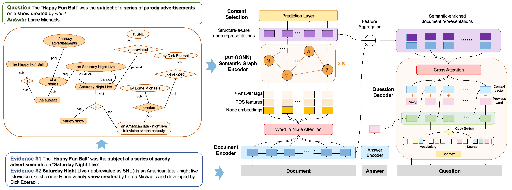

# Semantic Graphs for Generating Deep Questions

This repository contains code and models for the paper: [Semantic Graphs for Generating Deep Questions (ACL 2020)](https://www.aclweb.org/anthology/2020.acl-main.135/). Below is the framework of our proposed model (on the right) together with an input example (on the left).



## Requirements

#### Environment

```
pytorch 1.4.0
nltk 3.4.4
numpy 1.18.1
tqdm 4.32.2
```

#### Data Preprocessing

We release [all the datasets below](https://drive.google.com/open?id=1vj2pWYZ7s08f4qP8vHAd3FEHnYa_CTnn) which are processed based on [HotpotQA](https://hotpotqa.github.io/). 

1. get tokenized data files of `documents`, `questions`, `answers`

	* get results in folder [`text-data`](https://drive.google.com/open?id=11FxMXONXF4HJLzpWTaNfaAF_S5gFwklq)

2. prepare the json files ready as illustrated in [`build-semantic-graphs`](https://github.com/YuxiXie/SG-Deep-Question-Generation/tree/master/build-semantic-graphs)

	*  get results in folder [`json-data`](https://drive.google.com/open?id=1VHLOEcQaNdEGbyUVoGFXkdPbpR0-Lp9A)

3. run [`scripts/preprocess_data.sh`](https://github.com/YuxiXie/SG-Deep-Question-Generation/blob/master/scripts/preprocess_data.sh) to get the preprocessed data ready for training

	* get results in folder [`preprocessed-data`](https://drive.google.com/open?id=1hRAp40yABTq8ZMk1iVq74iOq4sZ7HPZq) and folder [`Datasets`](https://drive.google.com/open?id=1rlLq4f_T7vGpIzhF4a9cwQlygxmwF7Zv)
	
	* utilize `glove.840B.300d.txt` from [GloVe](https://nlp.stanford.edu/projects/glove/) to initialize the word-embeddings

#### Models

We release both classifier and generator models in this work. The models are constructed based on a ***sequence-to-sequence*** architecture. Typically, we use ***GRU*** and ***GNN*** in the encoder and ***GRU*** in the decoder, you can choose other methods (*e.g.* ***Transformer***) which have also been implemented in our repository.

* [classifier](https://drive.google.com/uc?id=18QiTTGwXJ6K-GTVGQS3Bmkv981qrCoA6&export=download): accuracy - 84.06773%

* [generator](https://drive.google.com/uc?id=1BwFxjiB4oK48PJOPldRaMSVCn9hofs--&export=download): BLeU-4 - 15.28304

## Training

* run [`scripts/train_classifier.sh`](https://github.com/YuxiXie/SG-Deep-Question-Generation/blob/master/scripts/train_classifier.sh) to train on the ***Content Selection*** task

* run [`scripts/train_generator.sh`](https://github.com/YuxiXie/SG-Deep-Question-Generation/blob/master/scripts/train_generator.sh) to train on the ***Question Generation*** task, the default one is to finetune based on the pretrained classifier

## Translating / Testing

* run [`scripts/translate.sh`](https://github.com/YuxiXie/SG-Deep-Question-Generation/blob/master/scripts/translate.sh) to get the prediction on the validation dataset

## Citation
```
    @inproceedings{pan-etal-2020-DQG,
      title = {Semantic Graphs for Generating Deep Questions},
      author = {Pan, Liangming and Xie, Yuxi and Feng, Yansong and Chua, Tat-Seng and Kan, Min-Yen},
      booktitle = {Proceedings of Annual Meeting of the Association for Computational Linguistics (ACL)},
      year = {2020}
    }
```
